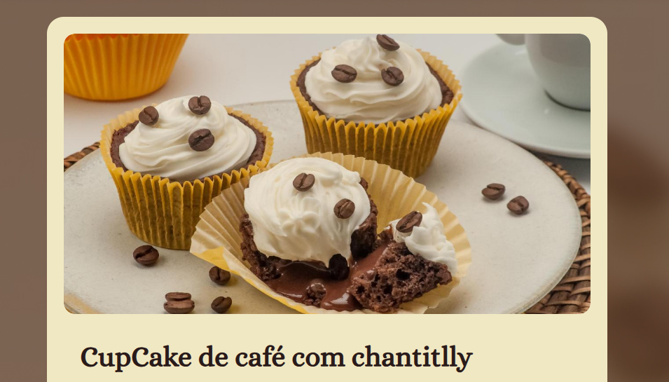

# Página de receita

> Formação Full-Stack: Iniciando o HTML e CSS (projeto prático)

O projeto é uma simples página de receita

[🔗 Clique aqui para acessar](https://natanjalmeida99.github.io/recipe-page/)

## 🛠️ Tecnologias

- HTML
- CSS
- Git e Github

## 💚 Contato

natanalmeida158@hotmail.com

---

Feito com ♥ by Rocketseat :wave: [Participe da nossa comunidade!](https://discord.gg/rocketseat)