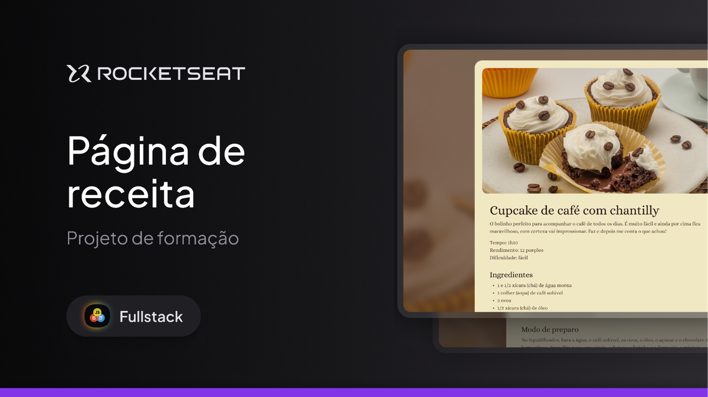

# Página de receita

<!--  -->

> Formação Full-Stack: Iniciando o HTML e CSS (projeto prático)

O projeto é uma simples página de receita

<!-- [🔗 Clique aqui para acessar](link do github pages/) -->

## 🛠️ Tecnologias

- HTML
- CSS
- Git e Github

## 💚 Contato

natanalmeida158@hotmail.com

---

Feito com ♥ by Rocketseat :wave: [Participe da nossa comunidade!](https://discord.gg/rocketseat)